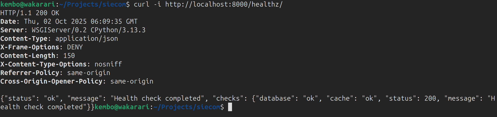

## Monitoring And Observability 
1. We have a `healthz` endpoint that is used to check for the health of:
 - application's ability to receive traffic
 - database readiness 
 - cache readiness 
This is quickly accomplished using `curl` tool `curl -i http://174.138.123.164/healthz/` typical response is as below:

2. We also have the following probes for the K8s cluster
 - `startUpProbe`: tells K8s when the app has finished booting and gives way for other probes to be run
 - `readinessProbe`: tells K8s when app is ready to serve traffic 
 - `livenessProbe`: tells K8s whether app is still alive and implements self healing
