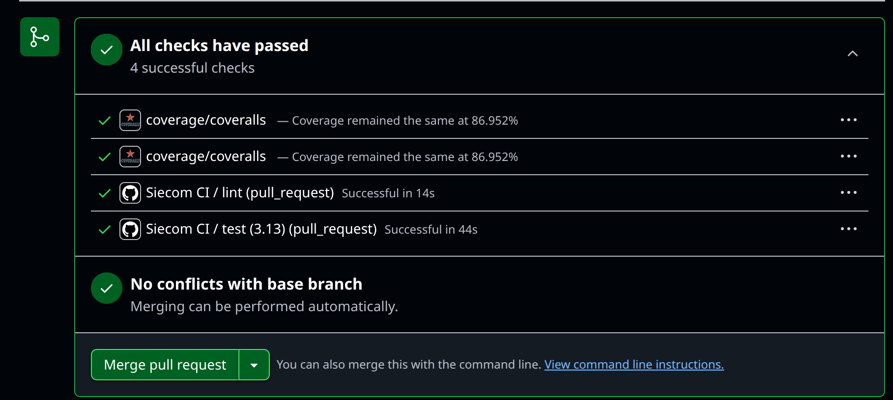

## Project Results
Here I provide annotated screenshots of the results of various project requirements

### Deployment Via Kubernetes
Successful deployment via kubectl from terminal

Microservice available online via public ip [http://174.138.123.164/]

Services consumed for this were:
- [docker hub](https://hub.docker.com/r/asininefatuity/siecom) to host the docker container
- [digital ocean kubernetes](https://www.digitalocean.com/products/kubernetes) to provision the kubernetes cluster
- [digital ocean command line interface](https://github.com/digitalocean/doctl) to connect provisioned cluster with `kubectl`

Details on **monitoring and observability** can be found [here](./monitoring.md)
### Unit & Integration Tests
The following screenshots are for a summary test runs and coverage report

### Email & SMS Confirmation
Email Confirmation to admin when order is made 

This was executed asynchronously by `huey`

Configured `Africa's Talking` successfully but upon sending messages, I got response that sender id was in blacklist (tried activating all promo messages), should have arrived otherwise

### Continuous Integration With Github Actions

### Continuous Deployment With Github Actions

Complete history for CI/CD can be viewed [in the actions tab](https://github.com/AsinineFatuity/siecom/actions)
